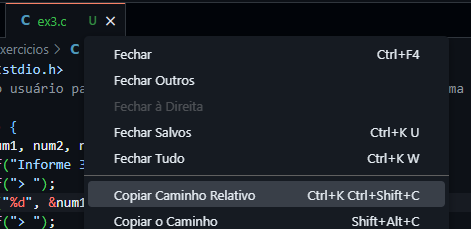
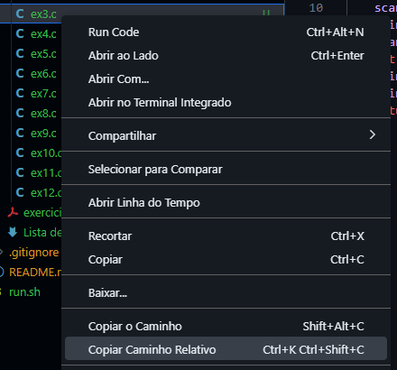

# Aprendendo C
Programas e exercícios criados durante o [curso de programação em C da Udemy](https://www.udemy.com/course/programacao-em-c-essencial/).


# Executando um programa em C
Clique com o botão direito na aba do arquivo aberto ou na árvore de arquivos e clique em "Copiar caminho relativo"

Pela aba do arquivo aberto | Pela árvore de arquivos
--|--
 | 

Abra o terminal no root e digite o seguinte comando:
```bash
./run.sh <caminho relativo>
```

## Como isso funciona?
O arquivo `run.sh` localizado no root do repositório, é um script de shell que deve receber como parâmetro o caminho relativo do arquivo .c para ser executado.
Ele executa os seguintes passos:
1. Compila o arquivo selecionado
2. Salva o executável na pasta não versionada `_comp` no root. Se esta pasta não existir ainda ele será criado
3. Limpa o terminal em que está sendo executado
4. Executa o arquivo compilado